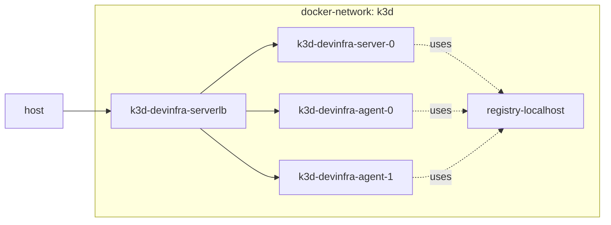

<!-- markdownlint-disable MD033 MD046 -->
# K3S Cluster

## Description

This `terraform` config will create a multi-node `k3s` cluster using `k3d` command-line inside a separate docker network and can add a private docker registry to push docker images.



## Installation

Make sure docker is up and running.

### Create the cluster

!!! Note
    When using `WSL2` (Windows Subsystem for Linux), you need to copy the context configuration to your `.kubeconfig` file on the `WSL2` home directory or the other way round, depending on which shell you use to run the `terraform` code.

    ```powershell
    cp /mnt/c/users/$(whoami)/.kube/config ~/.kube/config
    ```

    or

    ```powershell
    cp ~/.kube/config /mnt/c/users/$(whoami)/.kube/config
    ```

Create a `.env` file to store your `DOCKER_HOST` location. If left empty it'll take the default. Next, just apply the terraform code as usual.

```shell
cd ./src/clusters/k3s
echo "DOCKER_HOST=" >> .env
terraform init --upgrade
terraform apply --auto-approve
```

The cluster creation automatically add configuration to your `kubectl` contexts connect to so you can connect to the new cluster

```powershell
kubectl cluster-info --context k3d-devinfra
```

### Destroy the cluster

```shell
terraform destroy --auto-approve
```

## Terraform

<!-- BEGIN_TF_DOCS -->
### Requirements

| Name | Version |
|------|---------|
| terraform | >= 1.0 |
| docker | ~> 3.0.1 |

### Providers

| Name | Version |
|------|---------|
| docker | 3.0.1 |
| local | 2.4.0 |
| null | 3.2.1 |

### Modules

No modules.

### Resources

| Name | Type |
|------|------|
| [docker_network.k3d_network](https://registry.terraform.io/providers/kreuzwerker/docker/latest/docs/resources/network) | resource |
| [local_file.cluster-config](https://registry.terraform.io/providers/hashicorp/local/latest/docs/resources/file) | resource |
| [null_resource.cluster_create](https://registry.terraform.io/providers/hashicorp/null/latest/docs/resources/resource) | resource |
| [null_resource.cluster_delete](https://registry.terraform.io/providers/hashicorp/null/latest/docs/resources/resource) | resource |

### Inputs

| Name | Description | Type | Default | Required |
|------|-------------|------|---------|:--------:|
| cluster-name | Name of the cluster being created | `string` | `"devinfra"` | no |
| expose\_azurite | Expose Azurite externally | `bool` | `false` | no |
| expose\_jaeger | Expose Jaeger externally | `bool` | `false` | no |
| expose\_loki | Expose Loki externally | `bool` | `false` | no |
| expose\_nosql\_mongodb | Expose MongoDb externally | `bool` | `false` | no |
| expose\_opentelemetry | Expose OpenTelemetry Collector externally | `bool` | `false` | no |
| expose\_rabbitmq | Expose rabbitmq externally | `bool` | `false` | no |
| expose\_rds\_mariadb | Expose MariaDb externally | `bool` | `false` | no |
| expose\_rds\_mssql | Expose SQL Server externally | `bool` | `false` | no |
| expose\_rds\_mysql | Expose Mysql externally | `bool` | `false` | no |
| expose\_rds\_oracle | Expose Oracle externally | `bool` | `false` | no |
| expose\_rds\_postgres | Expose Postgres externally | `bool` | `false` | no |
| expose\_redis | Expose Redis externally | `bool` | `false` | no |
| expose\_seq | Expose Seq externally | `bool` | `false` | no |
| install\_private\_registry | Whether to start a private registry | `bool` | `true` | no |
| k3d-cluster-domain | The default domain name used in the cluster | `string` | n/a | yes |
| k3d-cluster-ip | The Cluster IP | `string` | `"0.0.0.0"` | no |
| k3d-cluster-name | K3DS cluster prefix | `list(string)` | <pre>[<br>  "k3d"<br>]</pre> | no |
| k3d-cluster-port | The port for the k8s API server | `number` | `6445` | no |
| k3d-network-gateway | The network gateway for the cluster | `string` | `"172.19.0.1"` | no |
| k3d-network-subnet | The subnet for the cluster | `string` | `"172.19.0.0/16"` | no |
| k3s-version | K3S version to use for the k3s containers | `string` | `"latest"` | no |
| server-node-count | The amount of server nodes | `number` | `1` | no |
| worker-node-count | The amount of worker nodes | `number` | `0` | no |

### Outputs

| Name | Description |
|------|-------------|
| clusters\_created | The named of the created cluster |
| expose\_azurite | The cluster is listen on Azurite ports (10000-10002) |
| expose\_jaeger | The cluster is listen on Jaeger ports (6831-6832) |
| expose\_loki | The cluster is listen on Loki port (3100) |
| expose\_nosql\_mongodb | The cluster is listen on MongoDB port (27017) |
| expose\_opentelemetry | The cluster is listen on OpenTelemetry Collector ports(4317-4318) |
| expose\_rabbitmq | The cluster is listen on Rabbitmq port (5672) |
| expose\_rds\_mariadb | The cluster is listen on MariaDB port (3307) (trying not to conflict with MySQL) |
| expose\_rds\_mssql | The cluster is listen on SQL Server port (1433) |
| expose\_rds\_mysql | The cluster is listen on MySQL port (3306) |
| expose\_rds\_oracle | The cluster is listen on Oracle port (1521) |
| expose\_rds\_postgres | The cluster is listen on Postgres port (5432) |
| expose\_seq | The cluster is listen on Seq port (5341) |
| k3d\_api\_port | Cluster port |
| k3d\_cluster\_ip | Cluster IP |
<!-- END_TF_DOCS -->