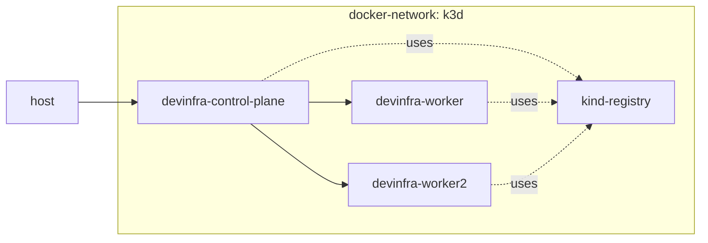

<!-- markdownlint-disable MD033 -->
# KinD cluster

## Description

This `terraform` config will create a multi-node `kind` cluster inside a separate docker network and can add a private docker registry to push docker images.



## Installation

```shell
cd ./src/clusters/kind
terraform init
terraform apply -auto-approve
```

```shell
terraform destroy -auto-approve
```

## Terraform documentation
<!-- BEGIN_TF_DOCS -->
### Requirements

| Name | Version |
|------|---------|
| terraform | >= 1.0 |
| docker | ~> 3.0.1 |
| environment | ~> 1.3.0 |
| kind | >= 0.0.13 |
| kubectl | >= 1.14.0 |

### Providers

| Name | Version |
|------|---------|
| docker | 3.0.1 |
| environment | 1.3.3 |
| kind | 0.0.16 |
| kubectl | 1.14.0 |
| null | 3.2.1 |
| time | 0.9.1 |

### Modules

No modules.

### Resources

| Name | Type |
|------|------|
| [docker_container.registry](https://registry.terraform.io/providers/kreuzwerker/docker/latest/docs/resources/container) | resource |
| [docker_image.registry](https://registry.terraform.io/providers/kreuzwerker/docker/latest/docs/resources/image) | resource |
| [docker_network.kind_network](https://registry.terraform.io/providers/kreuzwerker/docker/latest/docs/resources/network) | resource |
| [kind_cluster.devinfra-cluster](https://registry.terraform.io/providers/tehcyx/kind/latest/docs/resources/cluster) | resource |
| [kubectl_manifest.config-registry](https://registry.terraform.io/providers/gavinbunney/kubectl/latest/docs/resources/manifest) | resource |
| [null_resource.backup-kind-config](https://registry.terraform.io/providers/hashicorp/null/latest/docs/resources/resource) | resource |
| [null_resource.copy-kind-config](https://registry.terraform.io/providers/hashicorp/null/latest/docs/resources/resource) | resource |
| [time_sleep.wait_x_seconds](https://registry.terraform.io/providers/hashicorp/time/latest/docs/resources/sleep) | resource |
| [docker_registry_image.registry](https://registry.terraform.io/providers/kreuzwerker/docker/latest/docs/data-sources/registry_image) | data source |
| [environment_variables.wsl](https://registry.terraform.io/providers/EppO/environment/latest/docs/data-sources/variables) | data source |

### Inputs

| Name | Description | Type | Default | Required |
|------|-------------|------|---------|:--------:|
| cluster-name | The cluster name | `string` | n/a | yes |
| install\_private\_registry | Install a private docker registry | `bool` | `true` | no |
| kind-network-gateway | The default gateway for the cluster network | `string` | `"172.19.0.1"` | no |
| kind-network-subnet | The subnet to run the cluster in | `string` | `"172.19.0.0/16"` | no |
| kind\_version | The KinD image version to use | `string` | `"v1.24.3"` | no |
| worker-node-count | The amount of worker nodes (doesn't affect anything now) | `number` | `0` | no |

### Outputs

No outputs.
<!-- END_TF_DOCS -->