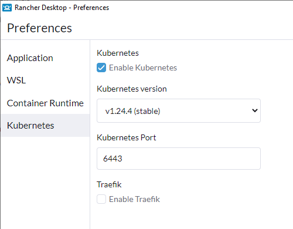

# Rancher Desktop K8S

!!!Warning
    `Rancher Desktop` creates a single-node `k8s` cluster.

If you want to use the kubernetes version of Rancher Desktop itself, just check the checkbox in the settings, but leave the `Traefik` checkbox empty as we will deploy our own version:

