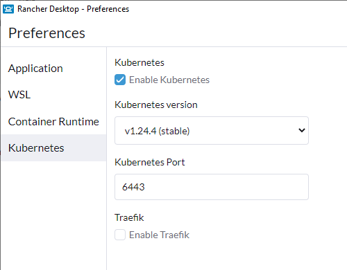

<!-- markdownlint-disable MD046 -->
# Preparation

## Installing commandline tools

Install/download the CLIs.

=== "Windows"

    ```powershell
    choco install kind
    choco install k3d
    choco install base64
    choco install mkcert
    choco install kubernetes-cli
    choco install kubernetes-helm
    choco install linkerd2
    choco install argocd-cli
    choco install flux
    choco install terraform
    choco install terraform-docs
    ```

=== "Linux"

    ```bash
    sudo apt-get update
    sudo apt-get install -y apt-transport-https ca-certificates curl wget libnss3-tools cl-base64

    # kind (if needed) (https://kind.sigs.k8s.io/docs/user/quick-start/#installing-from-release-binaries)
    curl -Lo ./kind https://kind.sigs.k8s.io/dl/v0.17.0/kind-linux-amd64
    chmod +x ./kind
    mv ./kind /usr/local/bin/kind

    # mkcert (if needed) (https://github.com/FiloSottile/mkcert#linux)
    curl -JLO "https://dl.filippo.io/mkcert/latest?for=linux/amd64"
    chmod +x mkcert-v*-linux-amd64
    sudo cp mkcert-v*-linux-amd64 /usr/local/bin/mkcert

    # kubctl (https://helm.sh/docs/intro/install/#from-apt-debianubuntu)
    sudo curl -fsSLo /usr/share/keyrings/kubernetes-archive-keyring.gpg https://packages.cloud.google.com/apt/doc/apt-key.gpg
    echo "deb [signed-by=/usr/share/keyrings/kubernetes-archive-keyring.gpg] https://apt.kubernetes.io/ kubernetes-xenial main" | sudo tee /etc/apt/sources.list.d/kubernetes.list
    sudo apt-get update
    sudo apt-get install -y kubectl

    # helm (https://helm.sh/docs/intro/install/#from-apt-debianubuntu)
    curl https://baltocdn.com/helm/signing.asc | gpg --dearmor | sudo tee /usr/share/keyrings/helm.gpg > /dev/null
    sudo apt-get install apt-transport-https --yes
    echo "deb [arch=$(dpkg --print-architecture) signed-by=/usr/share/keyrings/helm.gpg] https://baltocdn.com/helm/stable/debian/ all main" | sudo tee /etc/apt/sources.list.d/helm-stable-debian.list
    sudo apt-get update
    sudo apt-get install helm

    # argocd (if needed) (https://argo-cd.readthedocs.io/en/stable/cli_installation/#download-latest-version)
    curl -sSL -o argocd-linux-amd64 https://github.com/argoproj/argo-cd/releases/latest/download/argocd-linux-amd64
    sudo install -m 555 argocd-linux-amd64 /usr/local/bin/argocd
    rm argocd-linux-amd64

    # flux (https://fluxcd.io/flux/installation/#install-the-flux-cli)
    curl -s https://fluxcd.io/install.sh | sudo bash

    #linkerd (https://linkerd.io/2.12/getting-started/#step-1-install-the-cli)
    curl -sL https://run.linkerd.io/install | sh
    export PATH=$PATH:~/.linkerd2/bin

    #k3d (if needed) (https://k3d.io/v5.4.6/#install-script)
    wget -q -O - https://raw.githubusercontent.com/rancher/k3d/main/install.sh | bash

    # terraform (https://developer.hashicorp.com/terraform/downloads)
    wget -O- https://apt.releases.hashicorp.com/gpg | gpg --dearmor | sudo tee /usr/share/keyrings/hashicorp-archive-keyring.gpg
    echo "deb [signed-by=/usr/share/keyrings/hashicorp-archive-keyring.gpg] https://apt.releases.hashicorp.com $(lsb_release -cs) main" | sudo tee /etc/apt/sources.list.d/hashicorp.list
    sudo apt update && sudo apt install terraform

    wget https://github.com/terraform-docs/terraform-docs/releases/download/v0.16.0/terraform-docs-v0.16.0-linux-amd64.tar.gz && \
    tar -xzvf ./terraform-docs-v0.16.0-linux-amd64.tar.gz && \
    rm ./terraform-docs-v0.16.0-linux-amd64.tar.gz && \
    chmod +x ./terraform-docs && \
    sudo mv ./terraform-docs /usr/local/bin/terraform-docs
    ```

## Docker environment

### Docker Desktop

!!!Warning
    To use `Docker Desktop` commercially you'll need a [commercial license](https://www.docker.com/pricing/).

Run the installer from [Docker Desktop](https://www.docker.com/products/docker-desktop/).
To add WSL2 support to your k8s cluster of `Docker Desktop`, read the details in the [official blog](https://kubernetes.io/blog/2020/05/21/wsl-docker-kubernetes-on-the-windows-desktop/)

After installation, make sure you enable `WSL2` in the settings


### Rancher Desktop

Just run the installer from [Rancher Desktop](https://rancherdesktop.io/).

## Local K8S cluster installation

### K3D (preferred)

Edit `./src/clusters/k3d/terraform.tfvars` to your needs. By default it will create a 3-node cluster on a custom `Docker` network. Then run to create the cluster, run:

```shell
cd ./src/clusters/k3d
terraform init
terraform apply --auto-approve
```

!!! Note
    When using `WSL2` (Windows Subsystem for Linux), you need to copy the context configuration to your `.kubeconfig` file on the `WSL2` home directory or the other way round, depending on which shell you use to run the `terraform` code.

    ```powershell
    cp /mnt/c/users/$(whoami)/.kube/config ~/.kube/config
    ```

    or

    ```powershell
    cp ~/.kube/config /mnt/c/users/$(whoami)/.kube/config
    ```

The cluster creation automatically add configuration to your `kubectl` contexts connect to so you can connect to the new cluster

```powershell
kubectl cluster-info --context k3d-devinfra
```

To delete the cluster again, just run

```shell
terraform destroy --auto-approve
```

### KinD

#### Creating a cluster with `terraform`

Edit `terraform.tfvars` to your needs. Then run `terraform apply` to create the cluster.

```shell
cd ./src/clusters/kind
terraform init
terraform apply --auto-approve
```

Verify with

```hell
kubectl cluster-info --context kind-devinfra
```

#### Creating a 3-node k8s-cluster manually

An example of running a multi-node cluster on docker can be done with `kind`. There are some restrictions with Windows. The provided config `./src/clusters/kind/config-devinfra.yaml` provides a 3-node cluster. There is also a `traefik` ingress test setup to verify your networking configuration.

To fire up the cluster, run the following:

```powershell
kind create cluster --name=devinfra --config ./src/clusters/kind/config-devinfra.yaml
```

We specifically expose ports 80, 443 and 8100 to this cluster on ip `127.0.0.1`. Think carefully what ports to expose. `kind` has no update strategy to change this afterwards.


The cluster creation automatically add configuration to connect to the new cluster

```powershell
kubectl cluster-info --context kind-devinfra
```

To delete the cluster again

```powershell
kind delete cluster --name devinfra
```

When using WSL (Windows Subsystem for Linux), you need to copy the context configuration to your .kubeconfig file on the WSL home directory.

```powershell
cp /mnt/c/users/$(whoami)/.kube/config ~/.kube/config
```

### Docker Desktop K8s

!!!Warning
    `Docker Desktop` creates a single-node `k8s` cluster.
Enable `kubernetes` in the settings:


### Rancher Desktop K8S

!!!Warning
    `Rancher Desktop` creates a single-node `k8s` cluster.

If you want to use the kubernetes version of Rancher Desktop itself, just check the checkbox in the settings, but leave the `Traefik` checkbox empty as we will deploy our own version:



### Minikube

!!!Warning
    `Minikube` creates a single-node `k8s` cluster.

Basically there are 2 options, which look fairly the same. Either,

- run `minikube ` op windows with the `docker` driver and thus WSL2 and make it accessible in your WSL2 distro.
- run `minikube` on WSL2 directly following the [official blog](https://kubernetes.io/blog/2020/05/21/wsl-docker-kubernetes-on-the-windows-desktop/)

#### On Windows

> **Warning**
> `minikube` only provide a 1-node cluster

Fire up your cluster

```shell
minikube start
```


The cluster creation automatically add configuration to connect to the new cluster

```powershell
kubectl cluster-info --context minikube
```

#### On WSL2

To run `minikube` from WSL2, try this [blog post](https://hellokube.dev/posts/configure-minikube-ingress-on-wsl2/) or this [blog post](https://matheja.me/2020/04/08/getting-started-with-minikube-on-wsl2.html)
