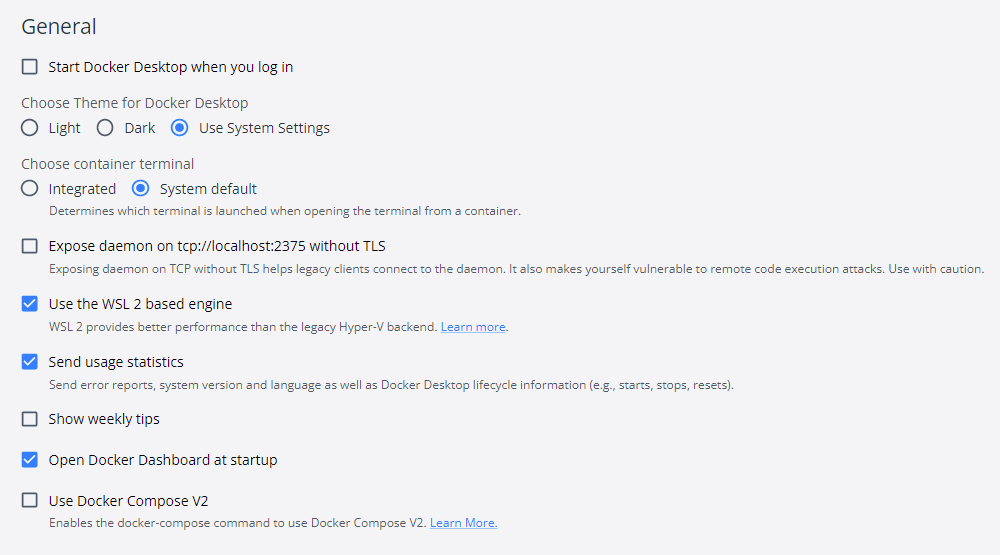
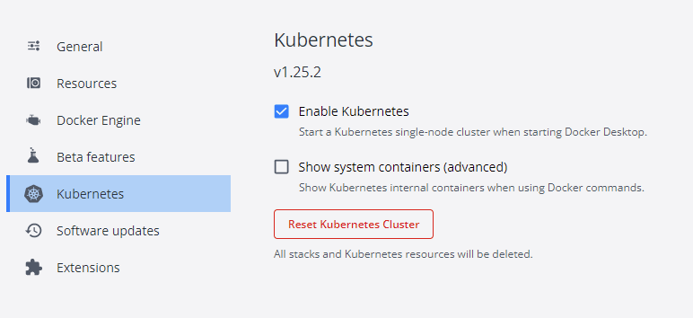

# Docker desktop

To add WSL2 support to your k8s cluster of Docker desktop, read the details in the [official blog](https://kubernetes.io/blog/2020/05/21/wsl-docker-kubernetes-on-the-windows-desktop/)

After installation, make sure you enable `WSL2` in the settings

and you enable `kubernetes` of course:

